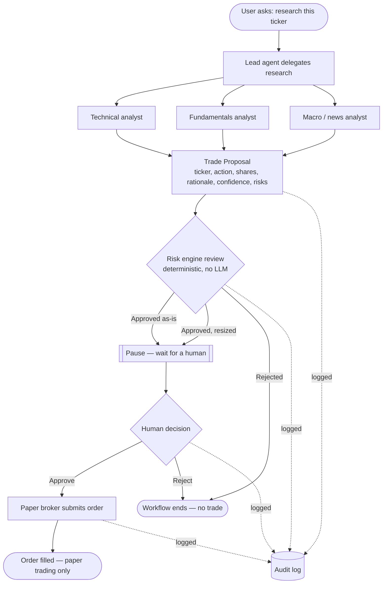
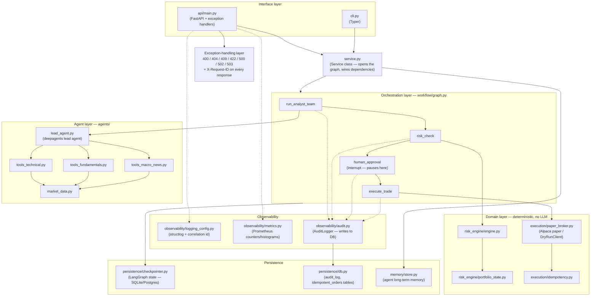

# Trading Desk Deep Agent — Architecture

An AI-assisted trading research desk. An LLM-driven analyst team researches a
ticker and drafts a trade proposal; a deterministic risk engine sizes or
rejects it; a human must explicitly approve it; only then does a paper
broker submit the order. No step in this pipeline can move money (even
simulated money) without a human in the loop.

## 1. Functional flow

What happens, in plain terms, from a research request to a filled (paper)
order.

**Key guardrail:** the LLM only ever produces steps B → C. It has no path
to G — order submission — without passing through the deterministic risk
engine (D) *and* an explicit human decision (F).

## 2. Technical flow

How that functional flow maps onto the actual codebase — layers, modules,
and where each piece lives.

**Notes on the layering:**

- **Interface** (`api/main.py`, `cli.py`) is intentionally thin — both just
  call into `Service`; all real logic lives below.
- **Orchestration** (`workflow/graph.py`) is a LangGraph `StateGraph`. The
  `human_approval` node calls `interrupt()`, which durably pauses the graph
  via the checkpointer — approval can arrive seconds or days later, even
  across a process restart.
- **Agent** and **Domain** are deliberately separate: the agent layer can
  only *propose*; the domain layer (`risk_engine`, `execution`) is plain,
  deterministic Python with no LLM calls, and is what actually gates and
  submits an order.
- **Persistence** backs three distinct concerns on one engine: LangGraph
  checkpoints (pause/resume state), the audit trail, and the idempotency
  ledger that stops a retried request from ever double-submitting an order.
- **Error handling** in `api/main.py` maps every failure — validation,
  business-rule, missing-thread, DB-down, upstream-timeout, or truly
  unexpected — to a consistent `{"error": {"code", "message",
  "request_id"}}` envelope, with a `request_id` on every response for log
  correlation.
- Due to time pressure this document has been created with the help of Claude

